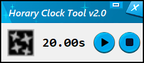

# Horary Clock Tool

Horary Clock Tool is a tool for the videogame Elsword which helps with timing certain character properties.

It's purpose is to let know Celestia players which Horary buff version will be applied upon casting the skill.

## Getting Started

### Download

You can Download the latest stable Horary Clock Tool version from the Releases page (#TODO: add LINK_TO_RELEASES)

### Running the tool

Extract the contents from the zipped file, and you should see something like this inside the Horary Clock Tool folder:

You can either run the application by running **HoraryClockUI.exe** or **Horary Clock**. A window like this should open:

### Configuration

You can  access the Settings Menu via clicking the Config Button:

You can change the default HotKeys, Language, Resolution and Clock Settings from here. Adjust the tool as you wish.

### Minimized Window

If you feel the UI is to big or contains unnecessary information, it is posible to minimize the window and Run Horary Clock in a more compact way by clicking the minimize button:

The minimized window looks like this:

You can pair it with the following options for a smooth experience:
* Windows Always On Top Checked
* Hotkeys configured
* Placing the window near your Skill Bar

Here is an example of how it would look:

